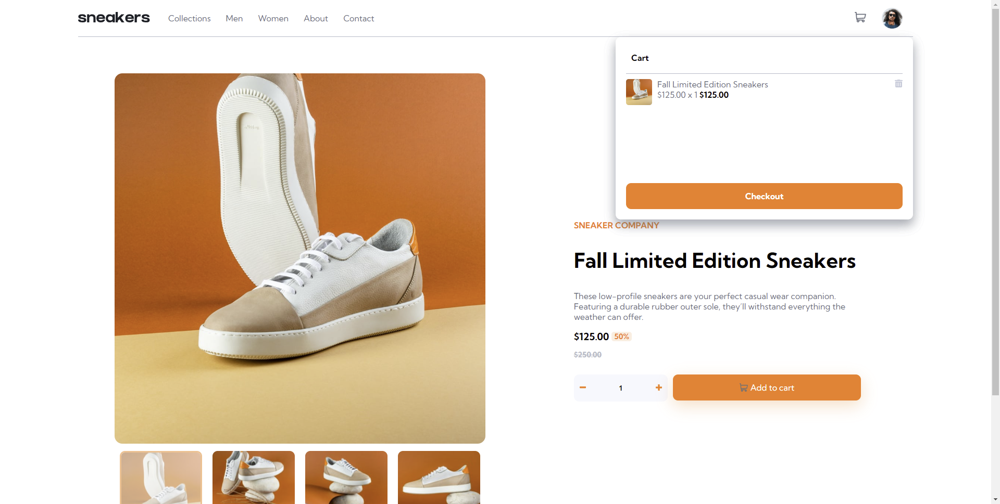

# Frontend Mentor - E-commerce product page solution

This is a solution to the [E-commerce product page challenge on Frontend Mentor](https://www.frontendmentor.io/challenges/ecommerce-product-page-UPsZ9MJp6). Frontend Mentor challenges help you improve your coding skills by building realistic projects.

## Table of contents

- [Overview](#overview)
  - [The challenge](#the-challenge)
  - [Screenshot](#screenshot)
  - [Links](#links)
- [My process](#my-process)
  - [Built with](#built-with)
  - [Continued development](#continued-development)

**Note: Delete this note and update the table of contents based on what sections you keep.**

## Overview

### The challenge

Users should be able to:

- View the optimal layout for the site depending on their device's screen size
- See hover states for all interactive elements on the page
- Open a lightbox gallery by clicking on the large product image
- Switch the large product image by clicking on the small thumbnail images
- Add items to the cart
- View the cart and remove items from it

### Screenshot

### Links

- Solution URL: https://github.com/rohtett/ecommerce-product-page-main)
- Live Site URL: [https://rohtett.github.io/ecommerce-product-page-main/)

## My process

### Built with

- Semantic HTML5 markup
- CSS custom properties
- Flexbox
- Mobile-first workflow
- Atom Editor(https://atom.io/)

### Continued development
#### Working Features
- Carousel function of display images.
- Functional add to cart functionality.
- Functioning modal when hamburger menu is shown(screen-sizes <768px).
- Clear cart and other cart display features working as intended.

#### Featured TBD and Bugs Found
- Unexpected closing of Cart when removing items from the cart.
- Better scaling and sizing according to varying screen-sizes (especially larger sizes).
- Checkout button currently not disappearing when cart is empty.
- Hover effects colouring/transparency settings replicated to a higher accuracy.
